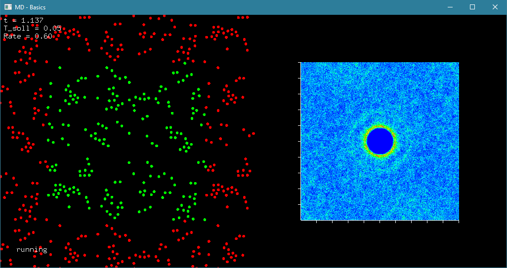

# Molecular Dynamics
Some C++ code for basic (non-quantum) Molecular Dynamics simulations in arbitrary dimension based on the Velocity Verlet algorithm.

Include `MDSim.h` to start. Define a potential as a function of a vector (as defined in vec.h), define a simulation box and starting condition, configure a Thermostat if needed. Check out `example.cpp` or `example_2D.cpp` to see how it works (requires freeglut for visuals).

Easiest way to check out the examples is via the VS solution: Restore nuget packages and build. You have to run the .exe with command line parameters `./SimpleMolecularDynamics.exe N dt rate start_temp` which are particle N = number, dt = time step, rate = thermostat rate and start_temp = starting temperature.

## Example 2D

You can pause and resume with *P*, raise and lower target temperature with *+* and *-* respectively. Red dots are images of particles in the simulation box in neighbouring boxes (periodic boundary conditions). With *g* you can switch between plots (current temperature, potential energy or radial particle distribution). Pressing *r* will reset the histogram for the radial distribution plot.

## Example 3D

Controls are the same as in 2D example. To run this from VS solution remove `example_2D.cpp` from project and add `example.cpp` instead. Depth (z-value) of the particles is visualized by hue.

If you play around with the particle numbers and temperatures, you can simulate freezing, melting, vaporation and other molecular processes, depending on the potential. The interaction potential in both of these examples is a Lennard-Jones type potential.

Proper API description will follow in the future, as will proper English comments to make the code more understandable. Also maybe I'll make a linkable library out of this with cith OpenCL-support and everything.

### TODO (if I ever feel like it):
- Parallelization of the algorithm to make use of all available CPU cores.
- Potentially OpenCL-based parallelization of the Velocity Verlet steps.
- Replacing vec and mat with the Eigen library.
- Adding support for different particle types -> Subclassing of the particle class
- Adding support for general many-body potentials.
- Convenience functions for the creation of typical starting conditions and simulation cells.
