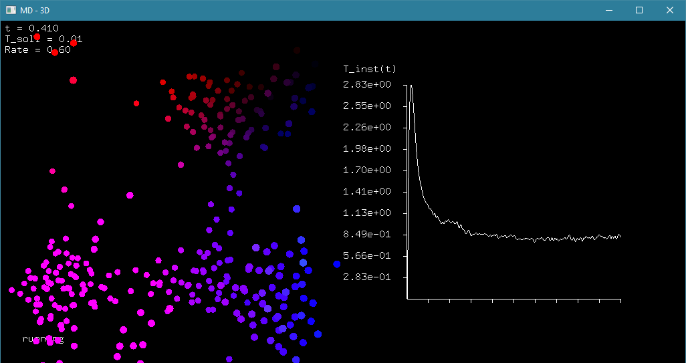

# Molecular Dynamics
Some C++ code for basic (non-quantum) Molecular Dynamics simulations in arbitrary dimension based on the Velocity Verlet algortihm.

Include `MDSim.h` to start. Define a potential as a function of a vector, define a simulation box and starting condition, configure a Thermostat if needed. Check out `example.cpp` or `example_2D.cpp` to see how it works (requires freeglut for visuals).

Easiest way to check out examples is via the VS solution: Restore nuget packages and build. You have to run the .exe with command line parameters `./SimpleMolecularDynamics.exe N dt rate start_temp` which are particle number, time step, thermostat rate and starting temperature.

## Example 2D

You can pause and resume with *P*, raise and lower target temperature with *+* and *-* respectively. Red dots are images of particles in the simulation box in neighbouring boxes (periodic boundary conditions).

## Example 3D

Controls are the same as in 2D example. To run this from VS solution remove `example_2D.cpp` from project and add `example.cpp` instead. Depth of the particle is visualized by hue.

If you play around with the particle numbers and temperatures, you can simulate freezing, melting, vaporation and other molecular processes. The interaction potential in both of these examples is a Lennard-Jones type potential.

There is a commented-out section in the examples to plot a correlation function of the particles instead of the current temperature, which allows to better identify phase transitions.

Proper API description will follow in the future, as will proper English comments to make the code more understandable. Also maybe I'll make a linkable library out of this with cith OpenCL-support and everything.
